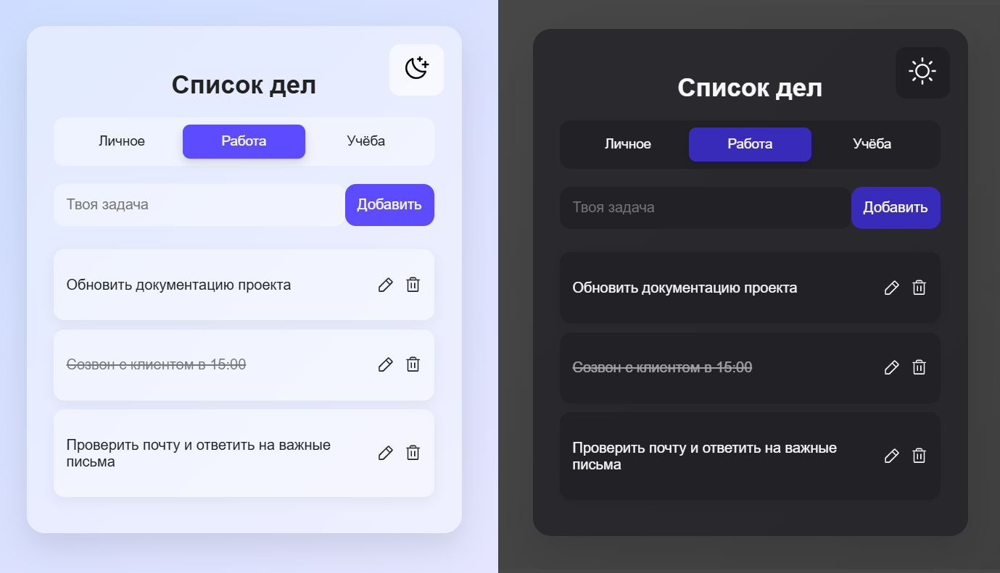

# ToDoList

## Table of Contents

- [Overview](#overview)
- [Built With](#built-with)
- [Features](#features)
- [Contact](#contact)

## Overview

This is a simple and elegant **To-Do List web application** built with React.  
It allows users to add, edit, delete, and categorize tasks, with support for light/dark themes.

Это простое и элегантное **веб-приложение для управления списком дел**, созданное на React.
Оно позволяет пользователям добавлять, редактировать, удалять и классифицировать задачи, а также поддерживает светлые и тёмные темы оформления.

### Built With

- [React](https://reactjs.org/)
- [Phosphor Icons](https://phosphoricons.com/)
- [CSS3](https://developer.mozilla.org/en-US/docs/Web/CSS)
- [JavaScript (ES6+)](https://developer.mozilla.org/en-US/docs/Web/JavaScript)

## Features

- Add, edit, and delete tasks
- Mark tasks as completed
- Categorize tasks (Work, Study, Personal)
- **Task timers** — set a countdown on any task:
  - The task color shifts green → yellow (halfway) → red (near the end)
  - When time runs out it plays a sound, shakes for ~2 seconds, then gets crossed out and stays **red**
  - Finishing a task early stops the timer, crosses it out, and turns it **green**
  - Tasks with active timers float above regular ones; the less time left, the higher it sits
- Light and dark theme toggle
- Responsive layout
- Smooth UI transitions
- State is saved to `localStorage`

------

- Добавление, редактирование и удаление задач
- Отметка выполненных задач
- Категоризация задач (работа, учёба, личные)
- **Таймеры на задачи** — можно поставить обратный отсчёт:
  - Цвет задачи меняется: зелёный → жёлтый (на половине) → красный (к концу)
  - Когда время выходит — звучит сигнал, задача трясётся ~2 секунды, затем зачёркивается и остаётся **красной**
  - Если выполнить задачу досрочно — таймер снимается, задача зачёркивается и становится **зелёной**
  - Задачи с активными таймерами стоят выше обычных; чем меньше времени осталось, тем выше
- Переключение между светлой и тёмной темами
- Адаптивный дизайн
- Плавные переходы
- Состояние сохраняется в `localStorage`

## Contact

- [GitHub](https://github.com/1tanat)
